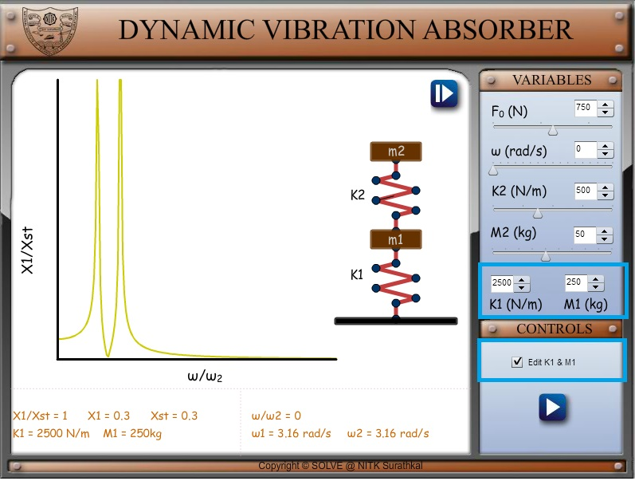
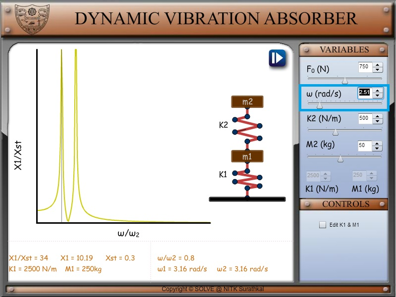
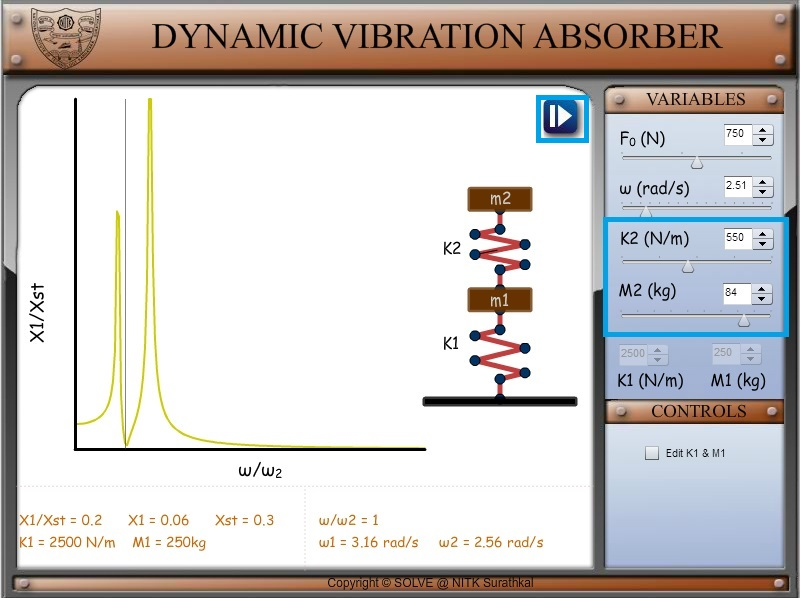
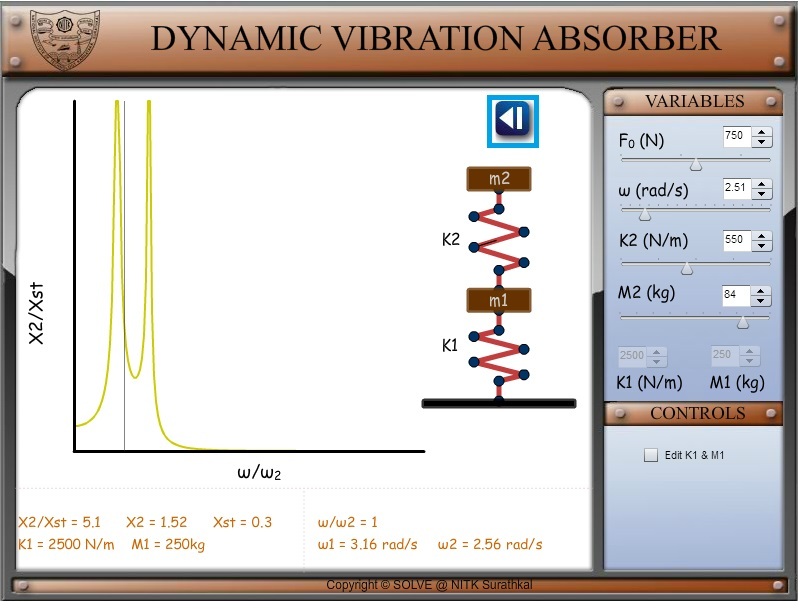

1. Set the value of primary mass and stiffness (m1, k1).  
   

2. Set the operating frequency at which you wish to operate the system.  
   

3. Edit the value of secondary mass and stiffness (m2, k2) such that the vibration in primary mass reduces.  
   

4. Click right arrow to observe the graph of X2/Xst  
   
