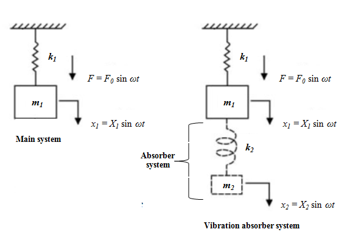

**Learning objectives**  
After completing this simulation experiment one should be able to

<li>Model a given real system to an equivalent simplified single degree
of freedom system and reducing the vibration of the main system adding an absorber system with suitable assumptions / idealisations.</li>
<li>Determine the amplitude of vibration for both main and additional system.</li>
<li>Tune a vibration absorber by varying dynamic system parameters.</li>
<li>Study the response of the vibration absorber for different excitation frequency and amplitude.</li>

**Dynamic vibration absorber**

When a structure is externally excited, it will have undesirable vibrations. The amplitude of vibration will be maximal when the system gets excited close to its naturalfrequency and this can cause rapid catastrophic failure. Hence it becomes necessary to neutralizethese vibrations. One of the methods for neutralizing these vibrations is by coupling a vibrating system to it so that the amplitude can be brought down to zero. This kind of vibrating system is known as vibration absorber or dynamic vibration absorber (DVA). DVA are used to control structural vibrations where it concentrates on neutralizing the amplitude of vibration at resonance. Some practical examples of dynamic vibration absorber showed in Fig 1 and 2.

Fig 1: Dynamic vibration absorber in steel stack

Fig 2: Dynamic vibration absorber PCB

To study the dynamic absorber system, a real system considered as main system is modelled as an equivalent single degree of freedom system and it is excited by a harmonic excitation force F= F0 sinωt. The steady state response of the system is given by x= X sin (ωt+φ). Steady state amplitude of vibration of the proposed single degree of freedom system will be maximum at the resonance. To neutralize the effect at resonance, the main system couples with an absorber system. This coupling will affect (suppress) the amplitude of vibration of the main system. By the addition of absorber system, single degree of freedom analysis cannot hold. Hence whole system should be considered two degree of freedom system.

Fig 3: A single degree of freedom system and vibration absorber system

Fig 4: Free body diagram of vibration absorber system

The free-body diagrams of the masses and are shown in Fig. 4. By application of Newton's second law of motion to each of the masses gives the equations of motion as:

 .....(1)

 .....(2)

Steady state response of two degree of freedom is assumed as,

 .....(3)

By substituting x1 and x2 in equation 1 and 2 we get,

 .....(4)

By solving the equation 3 and 4, amplitude of vibration of main system and absorber system given by,

 .....(5)

and

 .....(6)

From equation 5 it can be observed that the amplitude of vibration of main system X1 can be zero if numerator becomes zero. 

or

 .....(7)

From equation 7, it can be concluded that when the excitation frequency is equal to the natural frequency of the absorber, then main system amplitude becomes zero even though it is excited by harmonic force. Dimensionless form of equation 5 and 6 can be written as,

 .....(8)

 .....(9)

Equations 8 and 9 give the amplitude response of main system and absorber system as a function of exciting frequency. Where,

= Zero frequency deflection of the main system  
ω1= Natural frequency of the main system  
ω2= Natural frequency of the absorber system  
ω= Frequency of external excitation  
μ= ratio of absorber mass to the main mass

Fig 5 shows the variation of X1/Xst for different frequency ratios.

